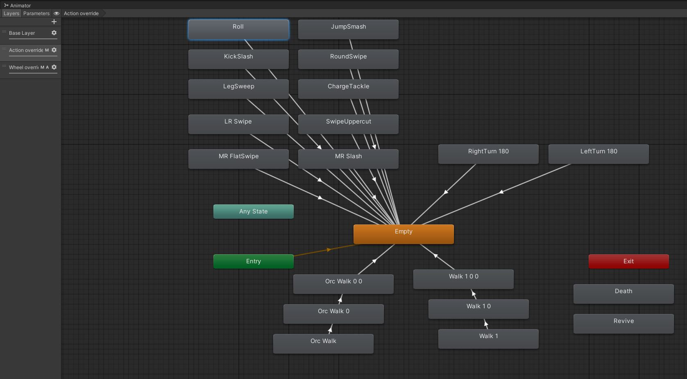

# Ten Shadows Die Ten Times
TSDTT is a passion project of mine, and is a direct fan game of the character Mahoraga from Jujutsu Kaisen. 

  

The game is set in a souls-like colosseum where Jonesy from Fortnite must defeat Mahoraga. 

## Installation
Download the latest release and extract the folder, then run TSDTT.exe.

  

## Gameplay
See an early playthrough of the game (click the image), although its had more patches since!

### Guide (Spoilers warning)

Boss Mechanics

Mahoraga has his 8 spoked Dharma wheel from mythology, which grants him the gradual but inevitable ability to adapt to any phenomenon. 

  

Attacking him provides him experience and speeds up the adaptation process. Once he's fully adapted, he becomes unaffected by your attacks and you will have to switch weaponry to reset his adaptation.

Phase 1

Here your aim is to deal damage to him to earn vBucks, which you spend on increasing your stats or unlocking perks. You are expected to use up your healing potions during this phase. Once you feel strong enough save up and buy the bloodthirster sword to progress.

Phase 2

Once you have bloodthirster you hit harder and sustain your hp through lifesteal.  Your aim is to kill him during this phase, although he won't truly "die" as the only way to defeat Mahoraga is to obliterate him all in one go. On downing him you receive a hefty vBucks award for your feat, and can unlock the final weapon to end the ritual.

Easter egg

There is a hidden easter egg which triggers upon you downing Mahoraga with the starter sword, and im not spoiling what it is here :)

## Yapping

Background

The inspiration for this project flared in conjunction with Season 2 of Jujutsu Kaisen dropping, in which the Mahoraga action scenes were elevated far beyond what the manga source material had outlined. The cinematic made Mahoraga stick in my head, and I decided to try at making a fan game for it. The actual idea is not original, and im not the first person to tie the character to dark souls themes, but I <strong>am</strong> the first person to make a game out of it.

  

The game was developed by me within the span of a two week Game Jam, although it was never entered into any such thing. I had no prior experience with Game Development or Unity Engine, but had a lot of passion for the idea and a drive to turn it into reality. Much appreciation goes out to Sebastion Graves' "Elden Ring in Unity" tutorial series on Youtube. This helped me learn how to develop games in Unity as well as providing implementations for core gameplay mechanics, e.g. the camera logic for which I never would've figured out the mathematics for on my own. 

  

Many character animations were sourced from free Mixamo uploads, with a few custom trimmed/altered ones I did manually in Blender. The Jonesy model was obtained easily from Sketchfab, but I had to look harder for a Mahoraga one. Eventually I found one which was broken and had pieces of the model misplaced, but upon fixing this manually it became usable. 

  

Reflections

If two weeks sounds like an insane timespan to do this in, it was. I was motivated, and I spent upwards of 12 hours a day on average working on this. This predictably led to burnout and a loss of passion around 60% of the way through the project. Sunken cost fallacy and gritting my teeth helped me to carry this project to the finish line but releasing it in a semi-buggy and unbalanced state is something I regret and was not happy with. In future it would not be a bad idea to work on passion projects more loosely and prioritise enjoyment, although I tend to obsess.

  

Working through Blender to edit animations and models was some of the worst experiences of this project for me. Keyframing animations and trying to fix buggy texturing especially on the Mahoraga model was just awful. In future will definitely try to avoid doing stuff through Blender unless necessary, much respect to people who do it for a living. 

  

### Credits
<strong>All rights belong to their respective owners, I do not own any of the IP used.</strong>